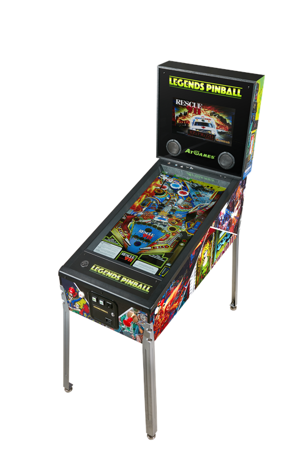

## Pinball Game using Bullet3 physics engine
The goal of this project is to make a pinball game using bullet physics engine, and threepp for visualising the game.

#### Example image
 

#### Progress so far
* Very little (Other school things have taken priority, most of the easter will probably go towards this though)
* Made functioning flippers in the physicsTest, aswell as testing the "simulated" gravity, and figuring out how bullet works. Not the best documented thing, but it's getting more understandable.

#### Todo
* Set up continuous integration ASAP
* Make the entire scene in a struct similar to "SnakeGame" in threepp examples, for simplicity of using key_pressed and key_released functions
* Write good and meaningful tests aswell as code that can be tested
* Want to do a point scoring system for hitting different things on the playing field, however this is not a top priority as I need a playing field first lol
* Figure out a good and efficient way of making the board in which the game is played.
* Make outer-playing field mesh, will most likely do this in Fusion 360 and import into the project. Objects that you hit for points will be added using threepp.

#### No tests for bullet....
Write some meaningfull text here about why not.

#### Sources:
Pinball textures from: https://ambientcg.com/view?id=Metal007